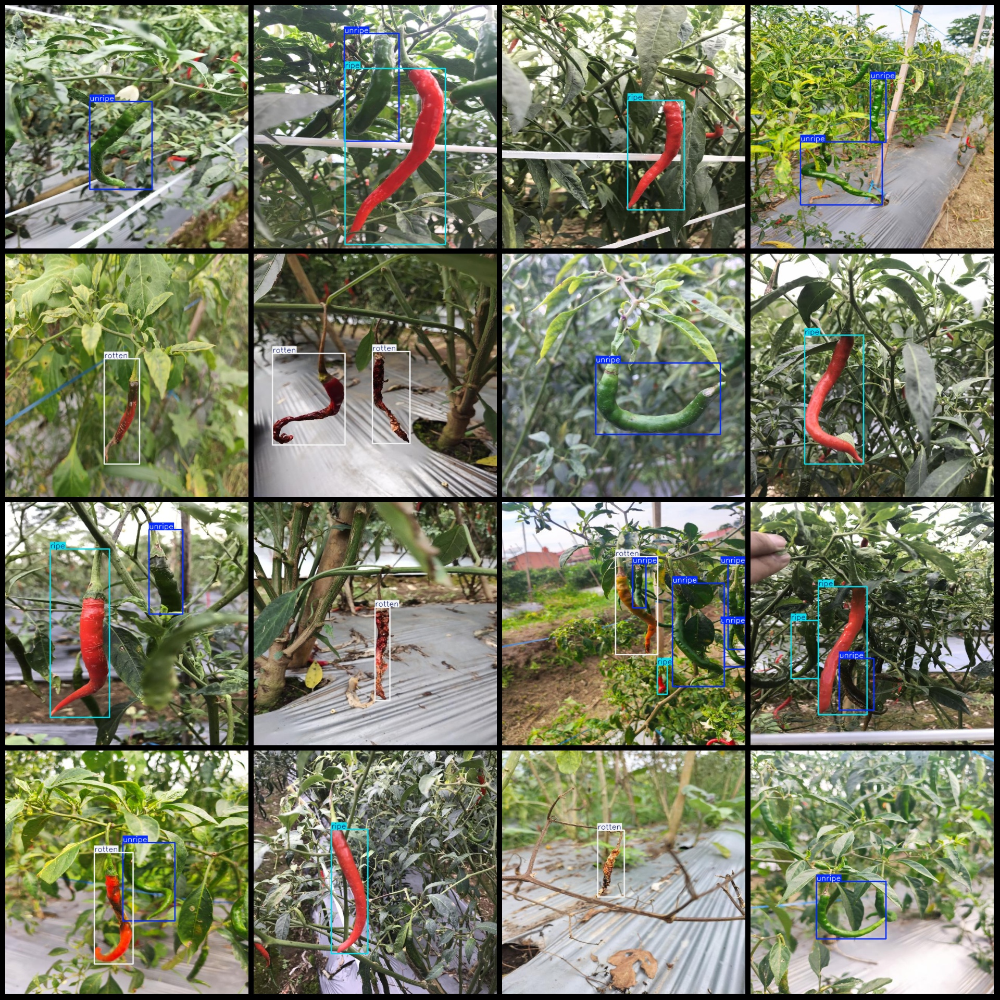
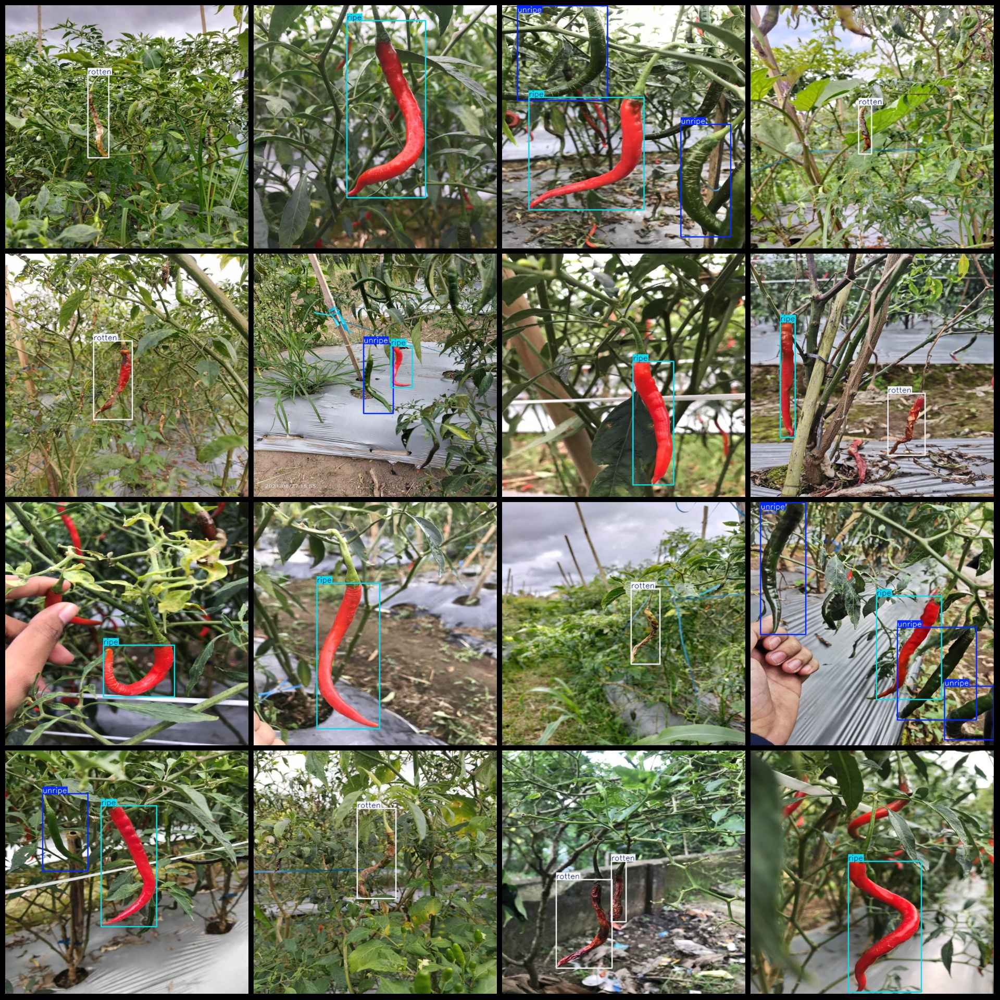

# Wisdom Agriculture Pepper Dataset: VOC+YOLO Format, 1257 Images in Three Categories

The dataset format is Pascal VOC format combined with YOLO format (without the split path in the txt file, only containing jpg images along with the corresponding VOC format xml files and YOLO format 
txt files).

Number of images (jpg file count): 1257
Number of annotations (xml file count): 1257
Number of annotations (txt file count): 1257
Number of categories: 3
Annotation category names (Note that the order of categories in the YOLO format does not correspond to this, but rather based on the labels folder's classes.txt): ["ripe", "rotten", "unripe"]
Each category has the number of bounding boxes:
The word "ripe" means "full of ripeness, ready to be eaten", and it is a noun. It doesn't have a numerical value like in mathematics or statistics.
Rotten = 374
Unripe = 843
Total bounding box count: 2044
Image resolution: 640x640
Annotation tool used: labelImg
Annotation rules: Draw bounding boxes for each category
Important Notice: The dataset does not have a training/validation/test split; you need to divide it yourself.
Special Notice: This dataset does not guarantee the accuracy of the trained models or the weights file.
Image Preview:
Annotation Example:
## Image

Here is a pay link on Stripe ( https://buy.stripe.com/3cs8yP7sY87d0vu9AB ). Please contact me lonlonago@foxmail.com after funding $89, and I will send you a complete data files , thank you!

